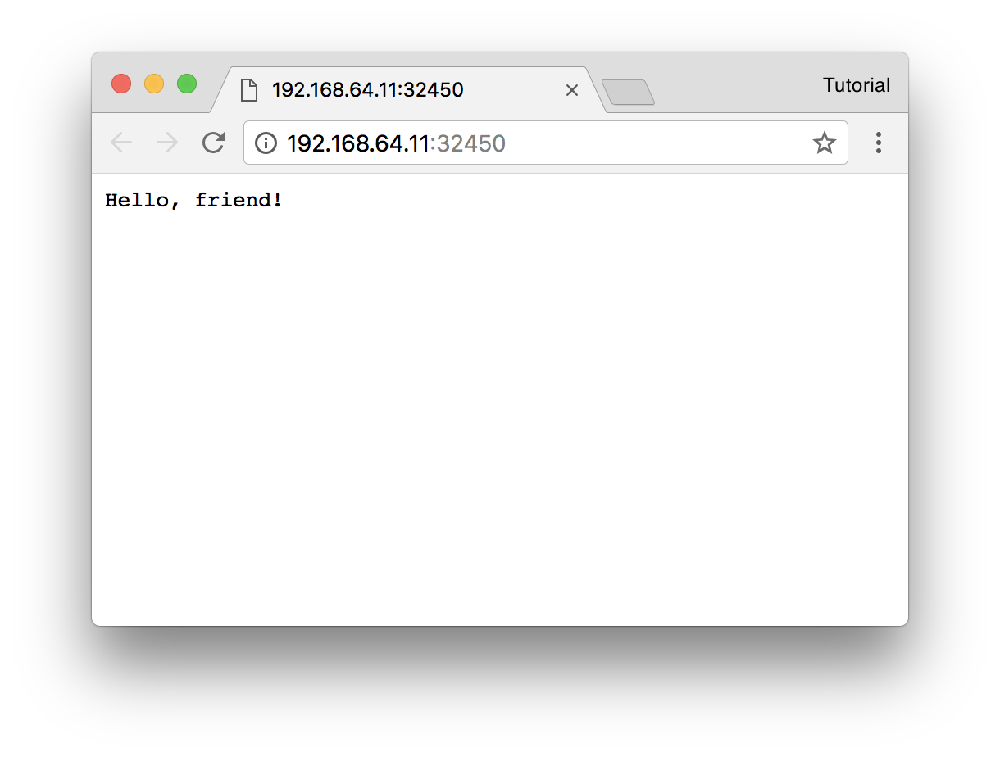

# Run a sample application

Start a small sample application in your kubernetes cluster. We'll use
[this][swa] app. It logs every http request made, so you can verify that the log
aggregator is working:

```bash
kubectl run --image manifoldco/service-catalog-simple-web-app simple-web-app
kubectl expose deployment --type NodePort --port 80 simple-web-app
```

```bash
minikube service simple-web-app
```

You should now see the web app running in your browser:



<br>

**Next**: [Install and configure service-catalog](install-and-configure-service-catalog.md)

[swa]: https://github.com/manifoldco/service-catalog-simple-web-app
