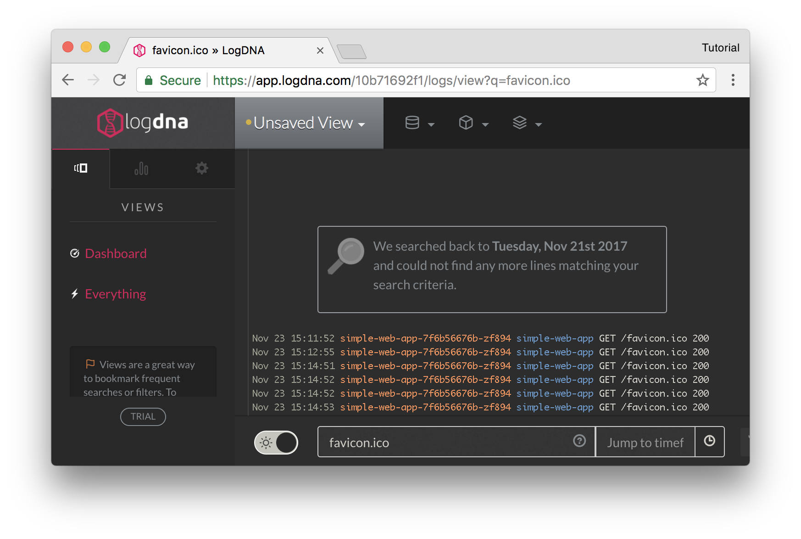

# Use the log aggregator

Install LogDNA's agent to gather logs for your cluster:

```bash
kubectl apply -f https://raw.githubusercontent.com/manifoldco/service-catalog-tutorial/labs/yaml/logdna-agent.yaml
```

*You can view the complete manifest [here][manifest]

The agent will use the secret configured by your service binding to speak to
LogDNA.

## View your logs

Find the name of your LogDNA resource in [Manifold][manifold]:

```bash
manifold list
```

Generate a single sign on link for LogDNA:

```bash
manifold sso $YOUR_RESOURCE_NAME_HERE
```
```
✔ Resource: tasteful-vanilla-dodecahedron (Tasteful Vanilla Dodecahedron)
Your SSO link for tasteful-vanilla-dodecahedron is https://api.logdna.com/manifold/v1/sso?code=████████████████&resource_id=████████████████
```

View this link in your browser, to see logs for your cluster, and your simple
web app:



<br>

Next: [Cleanup](cleanup.md)

[manifold]: https://www.manifold.co
[manifest]: https://raw.githubusercontent.com/manifoldco/service-catalog-tutorial/labs/yaml/logdna-agent.yaml
